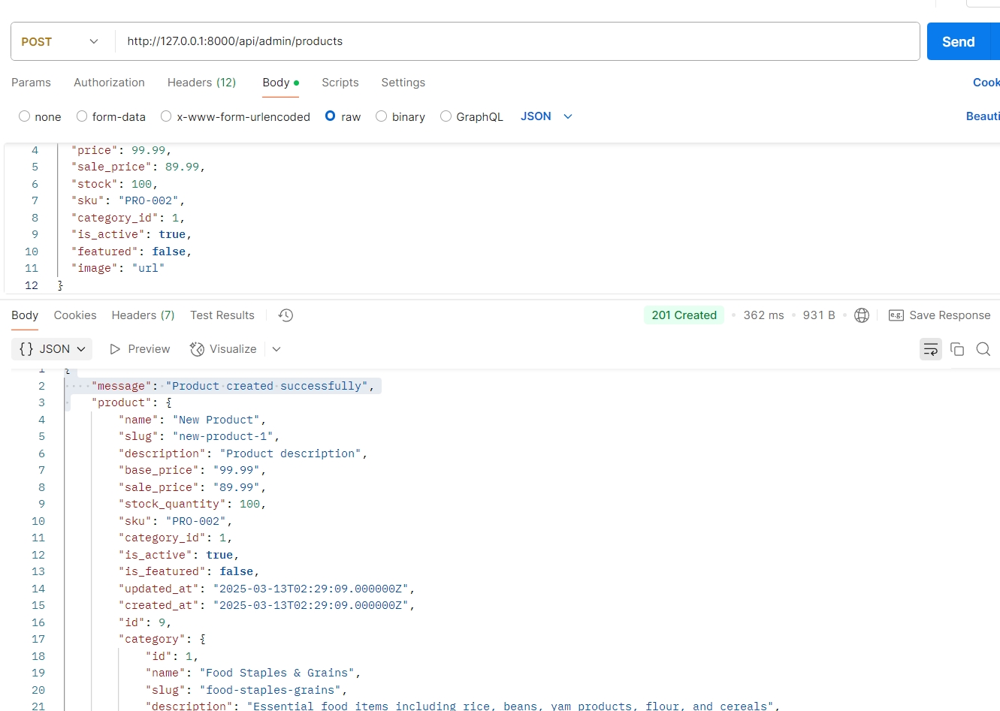

# M-Mart+ API Endpoints Documentation

This document provides a comprehensive list of all API endpoints available in the M-Mart+ application, along with test parameters and expected responses.

## Table of Contents
- [Authentication](#authentication)
- [Products & Categories](#products--categories)
- [User Profile](#user-profile)
- [Cart Management](#cart-management)
- [Orders](#orders)
- [Payments](#payments)
- [Coupons](#coupons)
- [Locations](#locations)
- [Admin Endpoints](#admin-endpoints)

## Authentication

### Register a New User ✅
```
POST /api/register
```

**Headers:**
```
Content-Type: application/json
Accept: application/json
```

**Request Body:**
```json
{
  "name": "Test User",
  "email": "testuser@example.com",
  "password": "password123",
  "password_confirmation": "password123",
  "phone": "1234567890"
}
```

**Success Response (201 Created):**
```json
{
  "message": "User registered successfully",
  "user": {
    "id": 1,
    "name": "Test User",
    "email": "testuser@example.com",
    "phone": "1234567890",
    "role": "customer",
    "created_at": "2025-03-12T01:25:20.000000Z",
    "updated_at": "2025-03-12T01:25:20.000000Z"
  },
  "token": "33|2i5sAJhzQ8EbwgKrdispo1XoKgRYa9ZrVWtuv6Nz7a84979e"
}
```

### Login ✅
```
POST /api/login
```

**Headers:**
```
Content-Type: application/json
Accept: application/json
```

**Request Body:**
```json
{
  "email": "testuser@example.com",
  "password": "password123"
}
```

**Success Response (200 OK):**
```json
{
  "message": "Login successful",
  "user": {
    "id": 1,
    "name": "Test User",
    "email": "testuser@example.com",
    "phone": "1234567890",
    "role": "customer",
    "created_at": "2025-03-12T01:25:20.000000Z",
    "updated_at": "2025-03-12T01:25:20.000000Z"
  },
  "token": "33|2i5sAJhzQ8EbwgKrdispo1XoKgRYa9ZrVWtuv6Nz7a84979e"
}
```

### Google Authentication ✅
```
POST /api/auth/google
```

**Headers:**
```
Content-Type: application/json
Accept: application/json
```

**Request Body:**
```json
{
  "id_token": "GOOGLE_ID_TOKEN"
}
```

### Google Authentication Test ✅
```
POST /api/auth/google/test

```

**Headers:**
```
Content-Type: application/json
Accept: application/json
```

**Request Body:**
```json
{
  "email": "user@example.com",
  "name": "User Name"
}
```

### Apple Authentication ❌
```
POST /api/auth/apple
```

**Headers:**
```
Content-Type: application/json
Accept: application/json
```

**Request Body:**
```json
{
  "id_token": "APPLE_ID_TOKEN",
  "name": "User Name"
}
```

### Forgot Password ✅
```
POST /api/forgot-password
```

**Headers:**
```
Content-Type: application/json
Accept: application/json
```

**Request Body:**
```json
{
  "email": "customer@mmart.com"
}
```

**Success Response (200 OK):**
```json
{
  "message": "Password reset link sent to your email"
}
```

### Reset Password ✅
```
POST /api/reset-password
```

**Headers:**
```
Content-Type: application/json
Accept: application/json
```

**Request Body:**
```json
{
  "token": "RESET_TOKEN",
  "email": "testuser@example.com",
  "password": "newpassword123",
  "password_confirmation": "newpassword123"
}
```

**Success Response (200 OK):**
```json
{
  "message": "Password has been reset successfully"
}
```

### Logout ✅
```
POST /api/logout
```

**Headers:**
```
Content-Type: application/json
Accept: application/json
Authorization: Bearer YOUR_TOKEN_HERE
```

**Success Response (200 OK):**
```json
{
  "message": "Successfully logged out"
}
```

## Products & Categories ✅

### List All Products  ✅
```
GET /api/products
```

**Headers:**
```
Accept: application/json
```

**Query Parameters (Optional):**
- `?page=1` - For pagination
- `?per_page=10` - Number of items per page
- `?category_id=1` - Filter by category
- `?search=keyword` - Search by keyword

**Success Response (200 OK):**
```json
{
  "data": [
    {
      "id": 1,
      "name": "Product Name",
      "description": "Product description",
      "price": 99.99,
      "sale_price": 89.99,
      "stock": 100,
      "category_id": 1,
      "images": ["url1", "url2"],
      "created_at": "2025-03-12T00:00:00.000000Z",
      "updated_at": "2025-03-12T00:00:00.000000Z"
    }
  ],
  "links": {
    "first": "http://localhost:8000/api/products?page=1",
    "last": "http://localhost:8000/api/products?page=5",
    "prev": null,
    "next": "http://localhost:8000/api/products?page=2"
  },
  "meta": {
    "current_page": 1,
    "from": 1,
    "last_page": 5,
    "path": "http://localhost:8000/api/products",
    "per_page": 10,
    "to": 10,
    "total": 50
  }
}
```

### Get Product Details ✅
```
GET /api/products/{product_id}
```

**Headers:**
```
Accept: application/json
```

**Success Response (200 OK):**
```json
{
  "data": {
    "id": 1,
    "name": "Product Name",
    "description": "Detailed product description",
    "price": 99.99,
    "sale_price": 89.99,
    "stock": 100,
    "category_id": 1,
    "images": ["url1", "url2"],
    "created_at": "2025-03-12T00:00:00.000000Z",
    "updated_at": "2025-03-12T00:00:00.000000Z"
  }
}
```

### List All Categories ✅
```
GET /api/categories
```

**Headers:**
```
Accept: application/json
```

**Success Response (200 OK):**
```json
{
  "data": [
    {
      "id": 1,
      "name": "Category Name",
      "slug": "category-name",
      "parent_id": null,
      "created_at": "2025-03-12T00:00:00.000000Z",
      "updated_at": "2025-03-12T00:00:00.000000Z"
    }
  ]
}
```

### Get Category Tree ✅
```
GET /api/categories/tree
```

**Headers:**
```
Accept: application/json
```

### Get Category Details ✅
```
GET /api/categories/{category_id}
```

**Headers:**
```
Accept: application/json
```

### Get Products by Category ✅
```
GET /api/categories/{category_id}/products
```

**Headers:**
```
Accept: application/json
```

**Query Parameters (Optional):**
- `?page=1` - For pagination
- `?per_page=10` - Number of items per page

## User Profile ✅

### Get Current User Profile ✅
```
GET /api/user
```

**Headers:**
```
Accept: application/json
Authorization: Bearer YOUR_TOKEN_HERE
```

**Success Response (200 OK):**
```json
{
  "id": 1,
  "name": "Test User",
  "email": "testuser@example.com",
  "email_verified_at": null,
  "phone": "1234567890",
  "profile_image": null,
  "role": "customer",
  "created_at": "2025-03-12T01:25:20.000000Z",
  "updated_at": "2025-03-12T01:25:20.000000Z"
}
```

### Update User Profile ✅
```
PUT /api/user/profile
```

**Headers:**
```
Content-Type: application/json
Accept: application/json
Authorization: Bearer YOUR_TOKEN_HERE
```

**Request Body:**
```json
{
  "name": "Updated Test User",
  "phone": "9876543210"
}
```

**Success Response (200 OK):**
```json
{
  "message": "Profile updated successfully",
  "user": {
    "id": 1,
    "name": "Updated Test User",
    "email": "testuser@example.com",
    "phone": "9876543210",
    "role": "customer",
    "created_at": "2025-03-12T01:25:20.000000Z",
    "updated_at": "2025-03-12T01:30:00.000000Z"
  }
}
```

## Cart Management ✅

### Get Cart ✅
```
GET /api/cart
```

**Headers:**
```
Accept: application/json
Authorization: Bearer YOUR_TOKEN_HERE
```

**Success Response (200 OK):**
```json
{
  "data": {
    "items": [
      {
        "id": 1,
        "product_id": 1,
        "product": {
          "id": 1,
          "name": "Product Name",
          "price": 99.99,
          "sale_price": 89.99,
          "image": "url"
        },
        "quantity": 2,
        "measurement_id": 1,
        "measurement": "1kg",
        "price": 89.99,
        "subtotal": 179.98
      }
    ],
    "total_items": 2,
    "subtotal": 179.98,
    "discount": 0,
    "total": 179.98
  }
}
```

### Add Item to Cart ✅
```
POST /api/cart/add
```

**Headers:**
```
Content-Type: application/json
Accept: application/json
Authorization: Bearer YOUR_TOKEN_HERE
```

**Request Body:**
```json

{
  "product_id": 4,
  "quantity": 8,
  "product_measurement_id": 3  //piece
}
{
  "product_id": 4,
  "quantity": 1,
  "product_measurement_id": 1   //pack of 6
}
{
  "product_id": 1,
  "quantity": 2
}

```

**Success Response (200 OK):**
```json
{
  "message": "Item added to cart",
  "data": {
    "items": [
      {
        "id": 1,
        "product_id": 1,
        "product": {
          "id": 1,
          "name": "Product Name",
          "price": 99.99,
          "sale_price": 89.99,
          "image": "url"
        },
        "quantity": 2,
        "measurement_id": 1,
        "measurement": "1kg",
        "price": 89.99,
        "subtotal": 179.98
      }
    ],
    "total_items": 2,
    "subtotal": 179.98,
    "discount": 0,
    "total": 179.98
  }
}
```

### Update Cart Item ✅
```
PUT /api/cart/update/{item_id}
```

**Headers:**
```
Content-Type: application/json
Accept: application/json
Authorization: Bearer YOUR_TOKEN_HERE
```

**Request Body:**
```json
{
  "quantity": 3
}
```

### Remove Cart Item ✅
```
DELETE /api/cart/remove/{item_id}
```

**Headers:**
```
Accept: application/json
Authorization: Bearer YOUR_TOKEN_HERE
```

### Clear Cart ✅
```
DELETE /api/cart/clear
```

**Headers:**
```
Accept: application/json
Authorization: Bearer YOUR_TOKEN_HERE
```

## Orders

### Create Order ✅
```
POST /api/orders
```

**Headers:**
```
Content-Type: application/json
Accept: application/json
Authorization: Bearer YOUR_TOKEN_HERE
```

**Request Body:**
```json ✅
{
  "payment_method": "cash_on_delivery", 
  "delivery_method": "shipping",
  "shipping_address": "123 Main St",
  "shipping_city": "Anytown",
  "shipping_state": "State",
  "shipping_zip": "12345",
  "shipping_phone": "1234567890",
  "notes": "Please deliver in the evening"
}
```json ✅
{
  "payment_method": "card",
  "delivery_method": "pickup",
  "pickup_location_id": 1,
  "notes": "I'll pick up after 5 PM"
}
```json ✅
{
  "payment_method": "bank_transfer",
  "delivery_method": "pickup",
  "pickup_location_id": 1,
  "notes": "Please keep items refrigerated until pickup"
}
```json ✅
{
  "payment_method": "mobile_money",
  "delivery_method": "shipping",
  "shipping_address": "456 Oak Avenue",
  "shipping_city": "Metropolis",
  "shipping_state": "New York",
  "shipping_zip": "10001",
  "shipping_phone": "9876543210",
  "notes": "Leave package with doorman"
}
```json ✅
{
  "payment_method": "cash_on_delivery",
  "delivery_method": "shipping",
  "shipping_address": "123 Main St",
  "shipping_city": "Anytown",
  "shipping_state": "State",
  "shipping_zip": "12345",
  "shipping_phone": "1234567890",
  "notes": "Please deliver in the evening"
}
```json ✅
{
  "payment_method": "card",
  "delivery_method": "shipping",
  "shipping_address": "789 Pine Street",
  "shipping_city": "Smallville",
  "shipping_state": "Kansas",
  "shipping_zip": "66002",
  "shipping_phone": "5551234567",
  "notes": "Ring doorbell upon arrival",
  "coupon_code": "WELCOME10"
}
```json ✅
{
  "payment_method": "card",
  "delivery_method": "shipping",
  "shipping_address": "789 Pine Street",
  "shipping_city": "Smallville",
  "shipping_state": "Kansas",
  "shipping_zip": "66002",
  "shipping_phone": "5551234567",
  "notes": "Ring doorbell upon arrival",
  "coupon_code": "FIXED500"
}
```json ✅
{
  "payment_method": "card",
  "delivery_method": "shipping",
  "shipping_address": "789 Pine Street",
  "shipping_city": "Smallville",
  "shipping_state": "Kansas",
  "shipping_zip": "66002",
  "shipping_phone": "5551234567",
  "notes": "Ring doorbell upon arrival",
  "coupon_code": "FREESHIP"
}
```

### List User Orders ✅
```
GET /api/orders
```

**Headers:**
```
Accept: application/json
Authorization: Bearer YOUR_TOKEN_HERE
```

### Get Order Details ✅
```
GET /api/orders/{order_id}
```

**Headers:**
```
Accept: application/json
Authorization: Bearer YOUR_TOKEN_HERE
```

### Cancel Order ✅
```
POST /api/orders/{order_id}/cancel
```

**Headers:**
```
Accept: application/json
Authorization: Bearer YOUR_TOKEN_HERE
```

## Payments ✅

### Get Payment Methods ✅
```
GET /api/payments/methods 
```

**Headers:**
```
Accept: application/json
Authorization: Bearer YOUR_TOKEN_HERE
```

### Process Payment ✅
```
POST /api/orders/{order_id}/payment
```

**Headers:**
```
Content-Type: application/json
Accept: application/json
Authorization: Bearer YOUR_TOKEN_HERE
```

**Request Body:**
```json 
{
  "payment_method": "card",
  "currency": "NGN",
  "country": "NG",
  "email": "customer@example.com",
  "phone_number": "08012345678",
  "name": "John Doe"
}
```json 
{
  "payment_method": "flutterwave",
  "redirect_url": "http://localhost:3000/payment/callback"
}
```

**Success Response (200 OK):**
```json
{
    "status": "success",
    "message": "Payment initialized",
    "redirect_url": "https://checkout-v2.dev-flutterwave.com/v3/hosted/pay/f3ff03be49630d10be24",
    "tx_ref": "MMART-1741827568-23"
}
```

### Verify Payment ✅
```
GET /api/payments/{payment_id}/verify
```

**Headers:**
```
Accept: application/json
Authorization: Bearer YOUR_TOKEN_HERE
```

**Success Response (200 OK):**
```json
{
    "status": "success",
    "message": "Payment verified successfully",
    "data": {
        "order_id": 23,
        "payment_status": "completed",
        "transaction_id": "8442211"
    }
}
```
### Payment Callback ✅
```
GET /api/payments/callback
```

**Query Parameters:**
- `?status=successful` - Payment status
- `?tx_ref=ORDER_REF` - Transaction reference
- `?transaction_id=FLW_TXN_ID` - Flutterwave transaction ID

### Flutterwave Webhook ❌
```
POST /api/webhooks/flutterwave
```

**Headers:**
```
Content-Type: application/json
verif-hash: YOUR_WEBHOOK_SECRET
```

**Request Body (Example):**
```json
{
  "event": "charge.completed",
  "data": {
    "id": 123456789,
    "tx_ref": "ORDER_REF",
    "flw_ref": "FLW_REF",
    "amount": 100.00,
    "currency": "NGN",
    "status": "successful",
    "payment_type": "card"
  }
}
```

## Coupons ✅

### Validate Coupon ✅
```
POST /api/coupons/validate
```

**Headers:**
```
Content-Type: application/json
Accept: application/json
```

**Request Body:**
```json
{
    "code": "DISCOUNT10",
    "order_amount": 200.00
}
{
    "code": "WELCOME10",
    "order_amount": 2000.00
}
```

## Locations✅

### List All Locations ✅
```
GET /api/locations
```

**Headers:**
```
Accept: application/json
```

**Response (Example):**
```json
[
  {
    "id": 1,
    "name": "M-Mart Downtown",
    "address": "123 Main Street",
    "city": "Lagos",
    "state": "Lagos State",
    "zip_code": "100001",
    "phone": "+234 123 456 7890",
    "email": "downtown@mmart.com",
    "latitude": 6.4550,
    "longitude": 3.3841,
    "is_active": true,
    "opening_hours": {
      "monday": "08:00-20:00",
      "tuesday": "08:00-20:00",
      "wednesday": "08:00-20:00",
      "thursday": "08:00-20:00",
      "friday": "08:00-22:00",
      "saturday": "09:00-22:00",
      "sunday": "10:00-18:00"
    },
    "created_at": "2023-01-01T00:00:00.000000Z",
    "updated_at": "2023-01-01T00:00:00.000000Z"
  },
  {
    "id": 2,
    "name": "M-Mart Lekki",
    "address": "456 Lekki Road",
    "city": "Lagos",
    "state": "Lagos State",
    "zip_code": "100002",
    "phone": "+234 123 456 7891",
    "email": "lekki@mmart.com",
    "latitude": 6.4698,
    "longitude": 3.5852,
    "is_active": true,
    "opening_hours": {
      "monday": "08:00-20:00",
      "tuesday": "08:00-20:00",
      "wednesday": "08:00-20:00",
      "thursday": "08:00-20:00",
      "friday": "08:00-22:00",
      "saturday": "09:00-22:00",
      "sunday": "10:00-18:00"
    },
    "created_at": "2023-01-01T00:00:00.000000Z",
    "updated_at": "2023-01-01T00:00:00.000000Z"
  }
]
```

### Get Single Location ✅
```
GET /api/locations/{id}
```

**Headers:**
```
Accept: application/json
```

**Response (Example):**
```json
{
  "id": 1,
  "name": "M-Mart Downtown",
  "address": "123 Main Street",
  "city": "Lagos",
  "state": "Lagos State",
  "zip_code": "100001",
  "phone": "+234 123 456 7890",
  "email": "downtown@mmart.com",
  "latitude": 6.4550,
  "longitude": 3.3841,
  "is_active": true,
  "opening_hours": {
    "monday": "08:00-20:00",
    "tuesday": "08:00-20:00",
    "wednesday": "08:00-20:00",
    "thursday": "08:00-20:00",
    "friday": "08:00-22:00",
    "saturday": "09:00-22:00",
    "sunday": "10:00-18:00"
  },
  "formatted_hours": {
    "monday": "08:00-20:00",
    "tuesday": "08:00-20:00",
    "wednesday": "08:00-20:00",
    "thursday": "08:00-20:00",
    "friday": "08:00-22:00",
    "saturday": "09:00-22:00",
    "sunday": "10:00-18:00"
  },
  "created_at": "2023-01-01T00:00:00.000000Z",
  "updated_at": "2023-01-01T00:00:00.000000Z"
}
```

### Find Nearby Locations ✅
```
GET /api/locations/nearby
```

**Headers:**
```
Accept: application/json
```

**Query Parameters:**
- `latitude` (required) - User's latitude (e.g., `6.4550`)
- `longitude` (required) - User's longitude (e.g., `3.3841`)
- `radius` (optional) - Search radius in kilometers (default: 6, max: 50)
- `limit` (optional) - Maximum number of results to return (default: 10, max: 50)
- `open_now` (optional) - Filter to only show currently open locations (accepted values: `true`, `false`, `1`, `0`)

**Example Request:**
```
GET /api/locations/nearby?latitude=6.4550&longitude=3.3841&radius=10&open_now=true
```

**Response (Example):**
```json
{
  "locations": [
    {
      "id": 1,
      "name": "M-Mart Downtown",
      "address": "123 Main Street",
      "city": "Lagos",
      "state": "Lagos State",
      "zip_code": "100001",
      "phone": "+234 123 456 7890",
      "email": "downtown@mmart.com",
      "latitude": 6.4550,
      "longitude": 3.3841,
      "is_active": true,
      "opening_hours": {
        "monday": "08:00-20:00",
        "tuesday": "08:00-20:00",
        "wednesday": "08:00-20:00",
        "thursday": "08:00-20:00",
        "friday": "08:00-22:00",
        "saturday": "09:00-22:00",
        "sunday": "10:00-18:00"
      },
      "distance": 0.5,
      "is_open": true,
      "created_at": "2023-01-01T00:00:00.000000Z",
      "updated_at": "2023-01-01T00:00:00.000000Z"
    },
    {
      "id": 2,
      "name": "M-Mart Lekki",
      "address": "456 Lekki Road",
      "city": "Lagos",
      "state": "Lagos State",
      "zip_code": "100002",
      "phone": "+234 123 456 7891",
      "email": "lekki@mmart.com",
      "latitude": 6.4698,
      "longitude": 3.5852,
      "is_active": true,
      "opening_hours": {
        "monday": "08:00-20:00",
        "tuesday": "08:00-20:00",
        "wednesday": "08:00-20:00",
        "thursday": "08:00-20:00",
        "friday": "08:00-22:00",
        "saturday": "09:00-22:00",
        "sunday": "10:00-18:00"
      },
      "distance": 4.2,
      "is_open": true,
      "created_at": "2023-01-01T00:00:00.000000Z",
      "updated_at": "2023-01-01T00:00:00.000000Z"
    }
  ],
  "search_radius": 6,
  "total_found": 2
}
```

## Admin Endpoints ✅

### Check Admin Authentication  ✅
```
GET /api/admin/check-auth
```

**Headers:**
```
Accept: application/json
Authorization: Bearer ADMIN_TOKEN_HERE
```
**Response:**
```json
{
    "message": "Admin authentication successful",
    "user": {
        "id": 1,
        "name": "Admin User",
        "email": "admin@mmart.com",
        "email_verified_at": null,
        "phone": null,
        "profile_image": null,
        "role": "admin",
        "created_at": "2025-03-11T17:33:05.000000Z",
        "updated_at": "2025-03-12T11:31:01.000000Z"
    },
    "is_admin": true
}
```

### Admin Product Management ✅

#### Create Product ✅
```
POST /api/admin/products
```

**Headers:**
```
Content-Type: application/json
Accept: application/json
Authorization: Bearer ADMIN_TOKEN_HERE
```

**Request Body:**
```json
{
  "name": "New Product",
  "description": "Product description",
  "price": 99.99,
  "sale_price": 89.99,
  "stock": 100,
  "sku": "PRO-002",
  "category_id": 1,
  "is_active": true,
  "featured": false,
  "image": "url"
}
{
  "name": "Rice (Multiple Sizes)",
  "description": "Premium quality basmati rice, available in different package sizes",
  "price": 12.99,
  "sale_price": 10.99,
  "stock": 50,
  "sku": "RICE-1001",
  "category_id": 1,
  "is_active": true,
  "featured": true,
  "image": "https://placehold.co/600x400?font=roboto&text=Rice%5CnMultiple%5CnSizes",
  "measurements": [
    {
      "name": "Small",
      "value": "500",
      "unit": "g",
      "price_adjustment": -3.00,
      "stock": 20,
      "is_default": false
    },
    {
      "name": "Medium",
      "value": "1",
      "unit": "kg",
      "price_adjustment": 0,
      "stock": 15,
      "is_default": true
    },
    {
      "name": "Large",
      "value": "5",
      "unit": "kg",
      "price_adjustment": 15.00,
      "stock": 10,
      "is_default": false
    }
  ],
  "images": [
    "https://placehold.co/600x400?font=roboto&text=Rice%5CnFront%5CnView",
    "https://placehold.co/600x400?font=roboto&text=Rice%5CnBack%5CnView",
    "https://placehold.co/600x400?font=roboto&text=Rice%5CnNutrition%5CnFacts"
  ]
}
```

#### Update Product
```
PUT /api/admin/products/{product_id}
```
```json
{
     "sku": "RICE-10013"
     
}
```
**Headers:**
```
Content-Type: application/json
Accept: application/json
Authorization: Bearer ADMIN_TOKEN_HERE
```

#### Delete Product ✅
```
DELETE /api/admin/products/{product_id}
```

**Headers:**
```
Accept: application/json
Authorization: Bearer ADMIN_TOKEN_HERE
```

### Admin Category Management ✅

#### List All Categories (Admin) ✅
```
GET /api/admin/categories
```
```json

```
**Headers:**
```
Accept: application/json
Authorization: Bearer ADMIN_TOKEN_HERE
```

#### Create Category ✅
```
POST /api/admin/categories
```

**Headers:**
```
Content-Type: application/json
Accept: application/json
Authorization: Bearer ADMIN_TOKEN_HERE
```

**Request Body:**
```json
{
  "name": "New Category",
  "slug": "new-category",
  "parent_id": null
}

{
  "name": "Food Staples & Grains",
  "description": "Basic food items including rice, pasta, and grains"
}
```

#### Update Category ✅
```
PUT /api/admin/categories/{category_id}
```
```json
{
  "name": "Updated Category Name",
  "description": "Updated description for this category",
  "parent_id": null
}
```
**Headers:**
```
Content-Type: application/json
Accept: application/json
Authorization: Bearer ADMIN_TOKEN_HERE
```

#### Delete Category ✅
```
DELETE /api/admin/categories/{category_id}
```

**Headers:**
```
Accept: application/json
Authorization: Bearer ADMIN_TOKEN_HERE
```

#### Get Category Tree (Admin) ✅
```
GET /api/admin/categories-tree
```

**Headers:**
```
Accept: application/json
Authorization: Bearer ADMIN_TOKEN_HERE
```

#### Reorder Categories ✅
```
POST /api/admin/categories-reorder
```
```json
{
  "categories": [
    {"id": 1, "order": 1},
    {"id": 2, "order": 2},
    {"id": 3, "order": 3}
  ]
}
```

**Headers:**
```
Content-Type: application/json
Accept: application/json
Authorization: Bearer ADMIN_TOKEN_HERE
```

### Admin Order Management ✅

#### List All Orders (Admin) ✅
```
GET /api/admin/orders
```

**Headers:**
```
Accept: application/json
Authorization: Bearer ADMIN_TOKEN_HERE
```

**Query Parameters (Optional):**
- `?status=pending` - Filter by status
- `?page=1` - For pagination

#### Update Order Status ✅
```
PUT /api/admin/orders/{order_id}/status
```

**Headers:**
```
Content-Type: application/json
Accept: application/json
Authorization: Bearer ADMIN_TOKEN_HERE
```

**Request Body:**
```json
{
  "status": "processing"
}
```

### Admin Coupon Management ✅

#### List All Coupons
```
GET /api/admin/coupons
```

**Headers:**
```
Accept: application/json
Authorization: Bearer ADMIN_TOKEN_HERE
```

#### Create Coupon ✅
```
POST /api/admin/coupons
```

**Headers:**
```
Content-Type: application/json
Accept: application/json
Authorization: Bearer ADMIN_TOKEN_HERE
```

**Request Body:**
```json
{
  "code": "SUMMER25",
  "type": "percentage",
  "value": 25,
  "min_order_amount": 100,
  "max_discount_amount": 50,
  "starts_at": "2025-06-01",
  "expires_at": "2025-08-31",
  "is_active": true
}
```

#### Update Coupon ✅
```
PUT /api/admin/coupons/{coupon_id}
```

**Headers:**
```
Content-Type: application/json
Accept: application/json
Authorization: Bearer ADMIN_TOKEN_HERE
```

#### Delete Coupon ✅
```
DELETE /api/admin/coupons/{coupon_id}
```

**Headers:**
```
Accept: application/json
Authorization: Bearer ADMIN_TOKEN_HERE
```

### Admin Location Management ✅

#### Create Location ✅
```
POST /api/admin/locations
```

**Headers:**
```
Content-Type: application/json
Accept: application/json
Authorization: Bearer ADMIN_TOKEN_HERE
```

**Request Body:**
```json
{
  "name": "Downtown Store",
  "address": "123 Main St, Anytown",
  "city": "Anytown",
  "state": "State",
  "postal_code": "12345",
  "country": "Country",
  "latitude": 37.7749,
  "longitude": -122.4194,
  "phone": "123-456-7890",
  "email": "downtown@mmartplus.com",
  "is_active": true
}
```

#### Update Location ✅
```
PUT /api/admin/locations/{location_id}
```

**Headers:**
```
Content-Type: application/json
Accept: application/json
Authorization: Bearer ADMIN_TOKEN_HERE
```

## Testing with Flutterwave

### Test Cards

#### Successful Payment
- Card Number: 5531 8866 5214 2950
- CVV: 564
- Expiry: 09/32
- PIN: 3310
- OTP: 12345

#### Failed Payment
- Card Number: 5258 5859 2266 6506
- CVV: 883
- Expiry: 09/31
- PIN: 3310
- OTP: 12345

### Webhook Testing
For local development, you can use ngrok to expose your local server to the internet:
```
ngrok http 8000
```

Then set the webhook URL in your Flutterwave dashboard to:
```
https://your-ngrok-url.ngrok.io/api/webhooks/flutterwave
